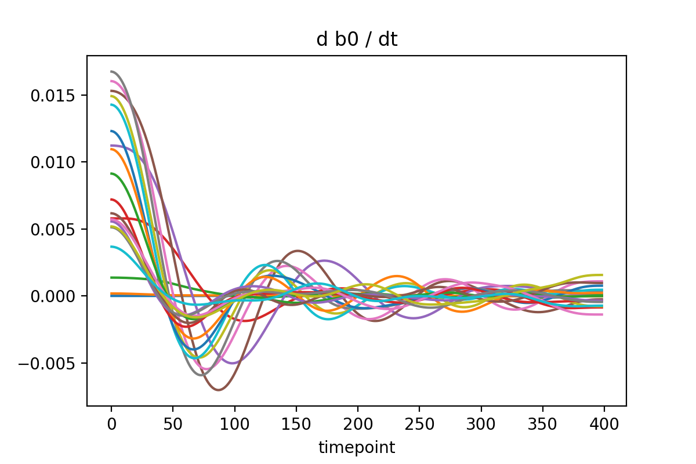
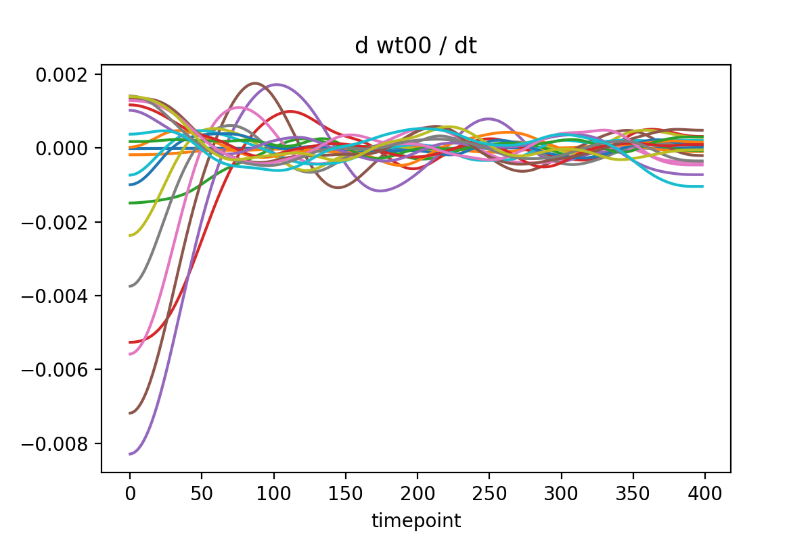
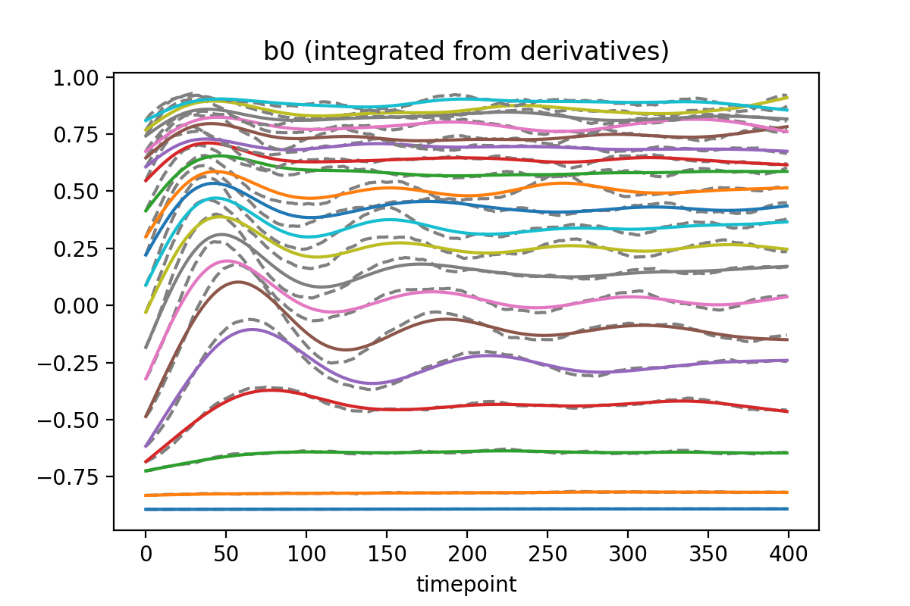
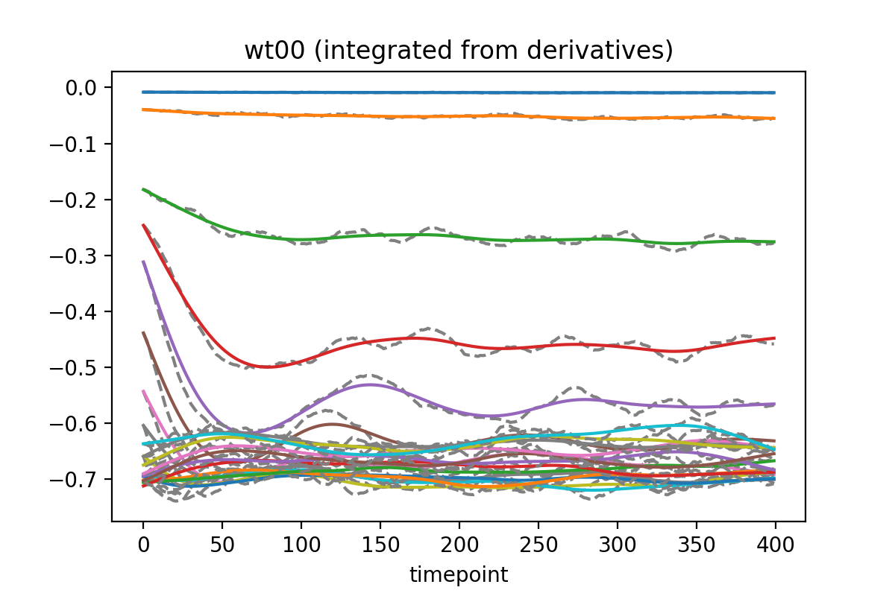
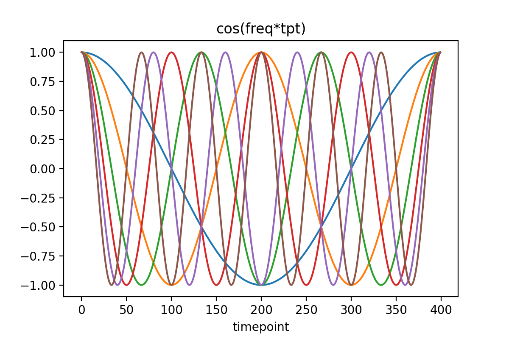
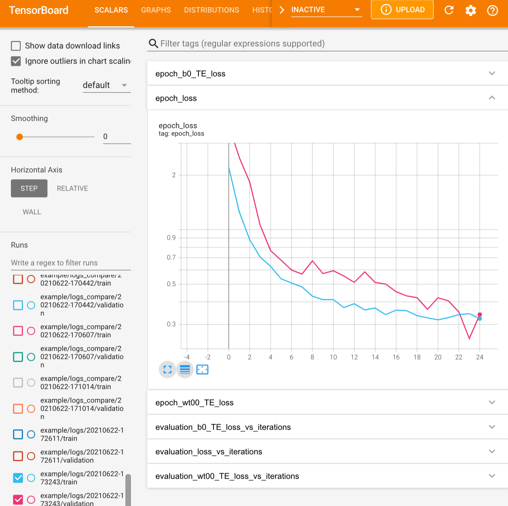
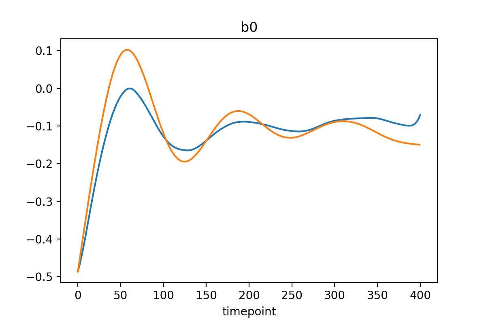

# Quickstart

Table of contents:
* [Import data](#import-data)
* [Get PCA parameters = network inputs](#get-pca-parameters-=-network-inputs)
* [Differentiate PCA parameters = network outputs](#differentiate-pca-parameters-=-network-outputs)
* [Build the network to be trained](#build-the-network-to-be-trained)
* [Inputs/outputs and Standardization](#inputs/outputs-and-standardization)
* [Train the network](#train-the-network)
* [Analyze the trained network](#analyze-the-trained-network)

## Import data

Everyting starts by importing some data. The shape of the imported array should be:
```
(no_timepoints, no_stoch_simulation_samples, no_species)
```
and the entries should be counts of each species.

If you used the Gillespie C++ library to generate data, you can use the already written convenince functions to import the data:
```
data_desc = DataDesc(
    no_seeds=1200,
    time_start=10,
    time_end=50,
    time_interval=0.1,
    species=["ca2i","ip3"]
)

data = ImportHelper.import_gillespie_ssa_from_data_desc(
    data_desc=data_desc,
    data_dir="..."
    )
```

Note that it's a good idea to do a standardizing transformation that transforms the data to have zero mean and unit variance, where averages are taken over both time and over stochastic simulation samples - see paper for details.

## Get PCA parameters = network inputs

Given the data of shape:
```
(no_timepoints, no_stoch_simulation_samples, no_species)
```
the PCA parameters are obtained by running:
```
# Create params traj and export
muh = np.zeros(1)
varh_diag = np.ones(1)
params_traj = ParamsTraj.fromPCA(data, data_desc.times, muh, varh_diag)
```
Here we are constructing the standard parameters, i.e. `muh=0 and varh=I`.

The number of latent species in this case is `1`, and is just specified through the dimension of `muh`, which must match the dimension of `varh_diag`.

You can write the params to a cache for later usage:
```
# Export
params_traj.export("cache/cache_params/%s.txt" % ip3)
```


## Differentiate PCA parameters = network outputs

To differentiate the PCA parameters in time, different strategies can be used, but total variation regulatization (TVR) is the best at calculating derivatives of noisy signals.
```
alphas = {
    "wt00": 100.0,
    "wt01": 5000.0,
    "b0": 100.0,
    "b1": 100.0,
    "sig2": 5000.0
}
non_zero_vals = list(alphas.keys())

# Differentiate
paramsTE_traj = params_traj.differentiate_with_TVR(
    alphas=alphas, 
    no_opt_steps=10, 
    non_zero_vals=non_zero_vals
    )

# Export
paramsTE_traj.export("cache/cache_deriv/%s.txt" % ip3)
```
Again, we have written the parameters to a cache for convenience.




After differentiating, you should re-integrate the derivatives to use as the inputs to the network. Otherwise the training data is inconsistent!
```
b1 = np.array([p.b[1] for p in params_traj.params_traj])
b1_mean = np.mean(b1)

# Integrate
no_steps = len(params_traj.params_traj) - 1
params_traj_filtered = ParamsTraj.fromIntegrating(
    paramsTE_traj=paramsTE_traj,
    params_init=params_traj.params_traj[0],
    tpt_start=0,
    no_steps=no_steps,
    constant_vals_lf={
        "sig2": 1.5 * 1e-6,
        "b1": b1_mean,
        "wt01": 0.00005
    }
    )

# Export
params_traj_filtered.export("cache/cache_filtered/%s.txt" % ip3)
```
You can set some of the values to be a constant here if they don't seem to contain any relevant information (looking at the PCA parameters, some are mostly just noise).




## Build the network to be trained

Now to the heart of it to build the network.

First specify the Fourier frequencies we intend to use to represent the latent variables:
```
# Freqs, coffs for fourier
freqs = np.array([1.,2.,3.,4.,5.,6.])
freqs = 2.0 * np.pi * freqs / data_desc.no_times
```




Next specify the reactions:
```
# Rxns
rxn_specs = [
    ("EAT",0,1),
    ("EAT",1,0),
    ("EAT",2,0),
    ("EAT",0,2),
    ("EAT",1,2),
    ("EAT",2,1),
    ("BIRTH",0),
    ("BIRTH",1),
    ("BIRTH",2),
    ("DEATH",0),
    ("DEATH",1),
    ("DEATH",2)
    ]
```
Finally make the input reaction layer. This is the first layer in the network:
```
muh_sin_coeffs_init = np.full(len(freqs),0.0)
muh_cos_coeffs_init = np.full(len(freqs),0.0)
varh_sin_coeffs_init = np.full(len(freqs),0.0)
varh_cos_coeffs_init = np.full(len(freqs),0.0)

# Reaction input layer
rxn_lyr = RxnInputsLayer.construct(
    nv=2,
    nh=1,
    freqs=freqs,
    muh_sin_coeffs_init=muh_sin_coeffs_init,
    muh_cos_coeffs_init=muh_cos_coeffs_init,
    varh_sin_coeffs_init=varh_sin_coeffs_init,
    varh_cos_coeffs_init=varh_cos_coeffs_init,
    rxn_specs=rxn_specs
    )
```

Next we will make the subnet that is the middle part of the network. This can be pretty much anything you like:
```
subnet = tf.keras.Sequential([
    tf.keras.layers.Dense(25, activation='relu', kernel_constraint=tf.keras.constraints.max_norm(1.)),
    tf.keras.layers.Dropout(0.5)
])
```

Put the input layer and the subnet together into a single model:
```
model = RxnModel.construct(
    nv=2,
    nh=1,
    rxn_lyr=rxn_lyr,
    subnet=subnet,
    non_zero_outputs=["wt00_TE","b0_TE"]
    )
```

## Inputs/outputs and Standardization

To get the actual inputs/outputs to pass to the network:
```    
# Training data
train_inputs0 = params_traj.get_tf_inputs_assuming_params0()
train_outputs0 = paramsTE_traj.get_tf_outputs_assuming_params0(non_zero_outputs=["wt00_TE","b0_TE"])
```
Again, we can specify the `non_zero_outputs` we actually want to network to predict, since some derivatives are just zero.

You should similarly construct some validation data.

We are almost ready to train the network, but we need to calculate input and output standardizations.

For the inputs:
```
# Reaction layer to use for the normalization
rxn_lyr_norm = RxnInputsLayer.construct(
    nv=2,
    nh=1,
    freqs=np.array([freqs[-1]]),
    muh_sin_coeffs_init=np.array([1.0]),
    muh_cos_coeffs_init=np.array([1.0]),
    varh_sin_coeffs_init=np.array([1.0]),
    varh_cos_coeffs_init=np.array([1.0]),
    rxn_specs=rxn_specs
    )

# Normalize inputs
model.calculate_rxn_normalization(
    rxn_lyr=rxn_lyr_norm, 
    inputs=train_inputs, 
    percent=0.2
    )
```
The standardization mean and std. dev. parameters are directly stored in the `RxnModel` class.

For the outputs:
```
# Normalize outputs

# Normalization size
percent = 1.0
norm_size = int(percent * len(train_outputs["wt00_TE"]))
print("Calculating output normalization from: %d samples" % norm_size)

# Normalize training
train_outputs_mean = {}
train_outputs_std_dev = {}
train_outputs_norm = {}
for key, val in train_outputs.items():
    idxs = np.arange(0,len(val))
    idxs_subset = np.random.choice(idxs,size=norm_size,replace=False)
    val_subset = val[idxs_subset]

    # Mean, std
    train_outputs_mean[key] = np.mean(val_subset,axis=0)
    train_outputs_std_dev[key] = np.std(val_subset,axis=0)

    if abs(train_outputs_mean[key]) < 1e-6:
        train_outputs_mean[key] = 0.0
    if abs(train_outputs_std_dev[key]) < 1e-6:
        train_outputs_std_dev[key] = 1.0

    train_outputs_norm[key] = (val - train_outputs_mean[key]) / train_outputs_std_dev[key]

# Normalize validation
valid_outputs_norm = {}
for key, val in valid_outputs.items():
    valid_outputs_norm[key] = (val - train_outputs_mean[key]) / train_outputs_std_dev[key]
```

## Train the network

Finally we're ready to train the model:
```
loss_fn = tf.keras.losses.MeanSquaredError()
opt = tf.keras.optimizers.Adam(learning_rate=0.001)
model.compile(optimizer=opt,
              loss=loss_fn,
              run_eagerly=False)

# Log for the tensorboard to monitor training
logdir = os.path.join("logs", datetime.datetime.now().strftime("%Y%m%d-%H%M%S"))
tensorboard_callback = tf.keras.callbacks.TensorBoard(logdir, 
    histogram_freq=1,
    write_graph=False
    )

# Write the weights with the best validation score
# Writing the entire graph here with save_weights_only=False is very slow
# So better to just write the weights instead
val_checkpoint = tf.keras.callbacks.ModelCheckpoint(
    'trained/weights_lowest_val', 
    monitor='val_loss', 
    verbose=1,
    save_best_only=True, 
    save_weights_only=True,
    mode='auto', 
    save_frequency=1
    )

# Train!
model.fit(
    train_inputs, 
    train_outputs_norm, 
    epochs=25, 
    validation_data=(valid_inputs,valid_outputs_norm),
    callbacks=[tensorboard_callback,val_checkpoint],
    batch_size=64
)

# Save final
model.save("trained/trained_final", save_traces=False)
```
The training can be visualized using `tensorboard` in the usual fashion:



## Analyze the trained network

To analyze the trained network, you direclty use the `integrate` method of the `RxnModel` class:
```
params_traj_int = model_trained.integrate(
    params_start=params_start,
    tpt_start=0,
    no_steps=120,
    time_interval=0.1,
    output_mean=train_outputs_mean,
    output_std_dev=train_outputs_std_dev
)
```
The learned trajectories (may) look like this:




